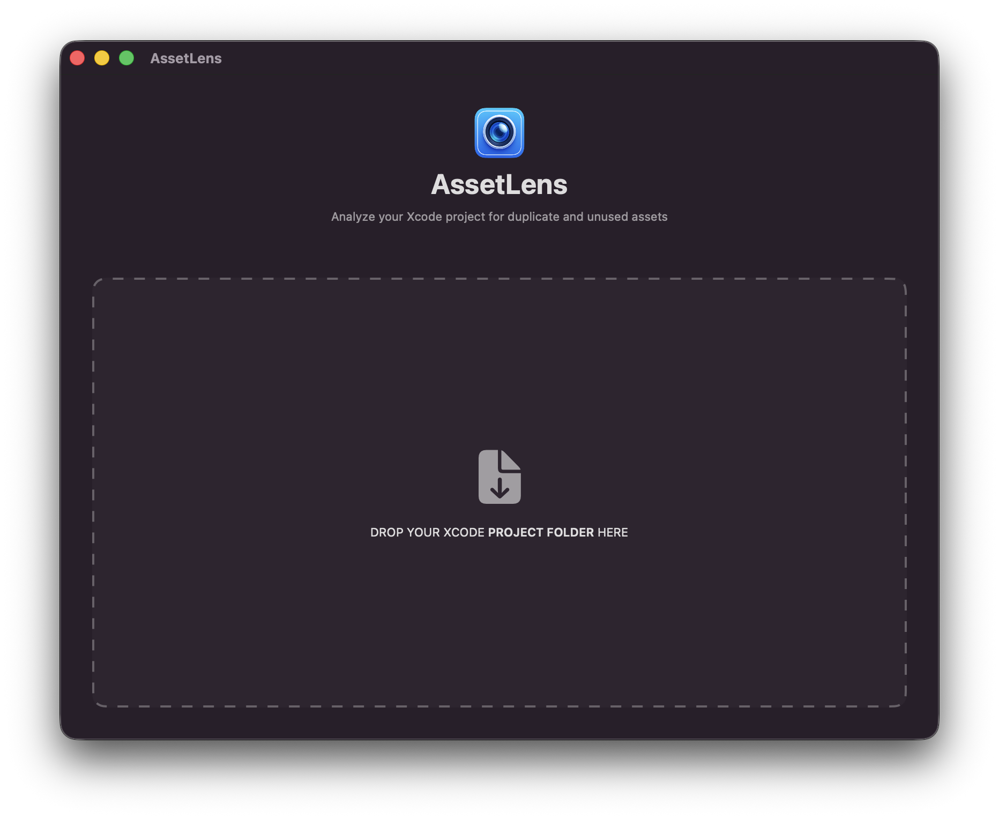
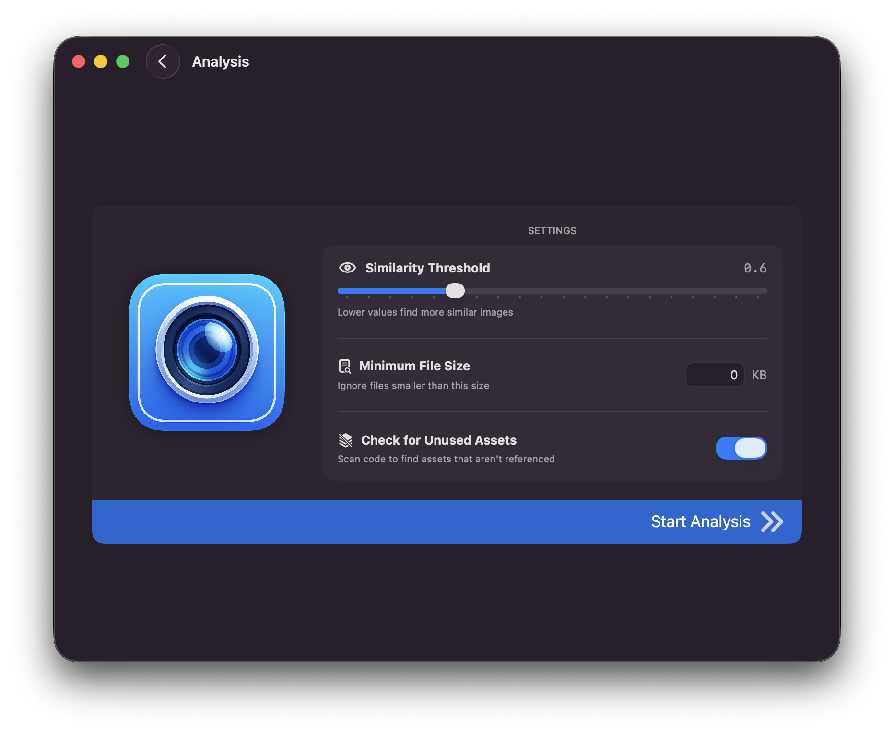
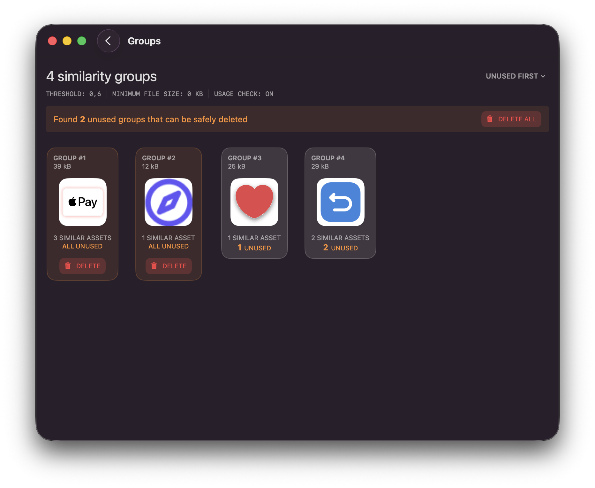
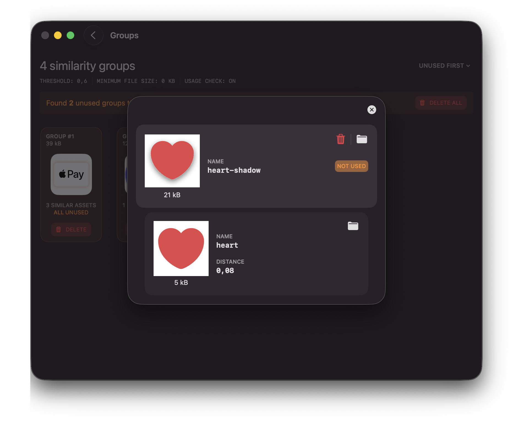

# AssetLens

A MacOS app and command line tool for finding visually similar assets in Xcode projects. 📱✨
> Uses [AssetlensCore](https://github.com/terlan98/assetlens-core) under the hood

# How does it work?
## Drag project folder

## Adjust analysis settings

## View similarity groups
- Delete unused groups

## View group details
- Delete individual unused assets belonging to a group
- Show assets in finder

# Perfect For
- Keeping your app lightweight by eliminating duplicates
- Facilitating asset organization for better developer experience

# License
This project is available under the GNU General Public License license.
